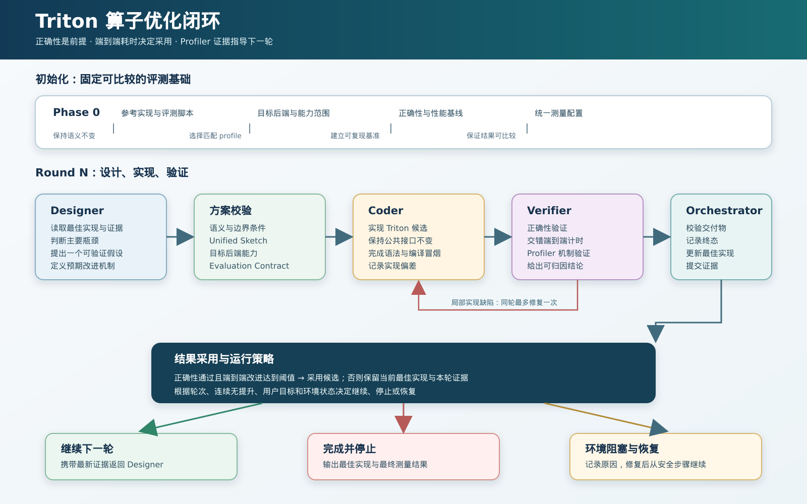
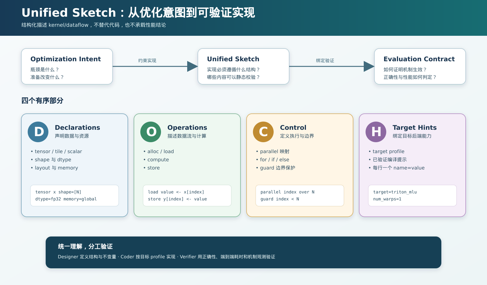

# Triton Optimization Skills

本目录提供可复用的 Triton 算子优化流程。`SKILL.md` 定义执行规则，角色契约明确职责边界，target profile 描述后端能力，辅助脚本负责校验、测量与状态推进。

## kernel-opt-loop

[`kernel-opt-loop/`](kernel-opt-loop/SKILL.md) 面向具有参考实现和 benchmark harness 的 Triton 算子优化任务。流程将工作拆分为四个明确角色：

- **Designer**：分析语义与性能证据，每轮提出一个可验证的优化方案；
- **Coder**：按照已确认的方案和目标后端能力实现 Triton 候选；
- **Verifier**：在目标设备上完成正确性、端到端耗时和 profiler 验证；
- **Orchestrator**：管理流程状态、角色交接、结果采用与恢复。

### 流程原则

1. 初始化阶段固定参考实现、评测方式、目标后端和性能基线。
2. 每轮只验证一个清晰、可证伪的优化假设。
3. 候选实现必须先通过正确性验证，再比较端到端性能。
4. 只有通过正确性且达到采用阈值的候选才替换当前最佳实现。
5. 未被采用的候选及其测量结果保留为后续优化依据。
6. 环境异常不会被误判为实现失败，修复后可以从安全步骤继续。

## Unified Sketch

Unified Sketch 将优化意图转换为结构化的实现约束，使 Designer、Coder 和 Verifier 对同一方案保持一致理解。它由四个有序部分组成：

- **D — Declarations**：输入输出、shape、dtype、layout、memory 和 tile；
- **O — Operations**：load、compute、store 等数据流与计算步骤；
- **C — Control**：并行映射、循环、条件和边界保护；
- **H — Target Hints**：目标 profile 以及已验证的编译提示。

Unified Sketch 不是伪代码，也不是性能结果。它是连接优化假设、Triton 实现和验证指标的可检查契约：Coder 据此实现，Verifier 根据对应的 Evaluation Contract 判断机制是否生效。

详细的执行规则、角色边界、状态转换和停止条件见 [`kernel-opt-loop/SKILL.md`](kernel-opt-loop/SKILL.md)。
