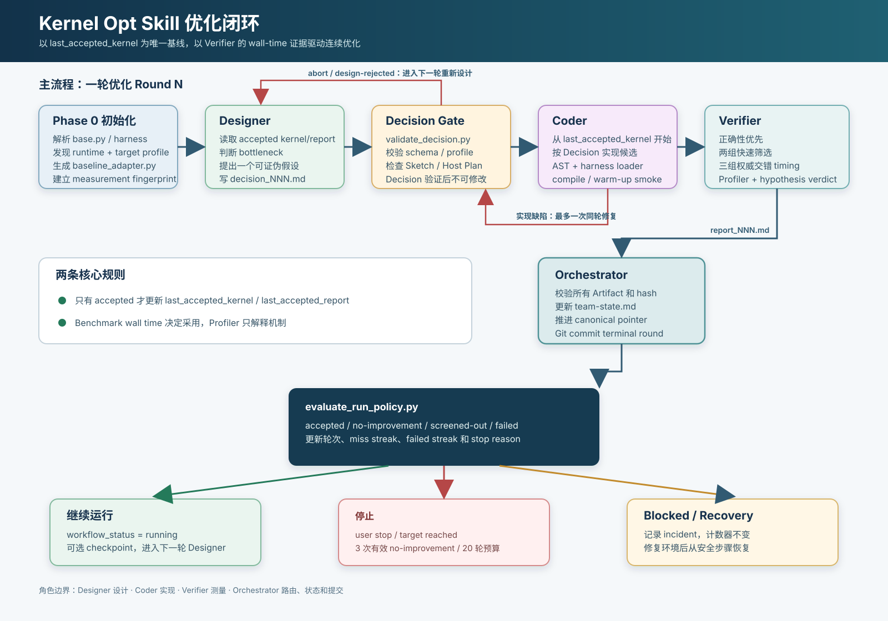

# Skills

本目录存放仓库内可复用的 Agent 技能。技能目录中的 `SKILL.md`、角色契约、target profile 和辅助脚本共同定义可执行流程；项目 campaign 产生的状态、候选代码和测量记录则保留在 `kernels/` 下。

## kernel-opt-loop

[`kernel-opt-loop/`](kernel-opt-loop/SKILL.md) 用于对具有不可变 `base.py` 和既有 benchmark harness 的 Triton 算子开展有边界的连续优化。它将职责拆分为 Designer、Coder、Verifier 和 Orchestrator，并通过持久化 artifact 和 Git 提交保持每轮可恢复、可审计。

流程要点：

- Phase 0 固化运行时、target profile、基线实现与 measurement fingerprint。
- Designer 每轮只提出一个可证伪的优化假设；Coder 从当前 accepted implementation 实现候选；Verifier 独占真实设备进行正确性、wall-time 和 profiler 验证。
- 只有 `accepted` 结果可推进 `last_accepted_kernel` 和 `last_accepted_report`。被拒绝或失败的候选保留为证据，不能作为下一轮基线。
- 是否采用候选由比赛定义的 e2e benchmark wall time 决定；kernel time、kernel count 与 host overhead 用于定位瓶颈和选择下一轮优化。
- 每个终态 round 提交后，由策略评估决定继续、停止或因环境问题进入可恢复的 blocked 状态。

详细的运行契约、角色边界和停止策略见 [`kernel-opt-loop/SKILL.md`](kernel-opt-loop/SKILL.md)。

## vNext 边界

Profile onboarding 可以运行版本化 probes、产出哈希化 run-local evidence 与
proposed promotion candidate，并且可以不创建 campaign 就结束。它绝不编辑 canonical
implementation profile。

vNext campaign 记录 `contract_version: 3`、冻结的 implementation-profile snapshot
哈希、project capability claim、typed Sketch、binding ledger 与 verdict artifact。
现有 v1/v2 campaigns 保持历史只读，不做迁移。

每个 Triton submission snapshot 只运行一次离线、有界、config-only 的搜索，覆盖
profile-legal 字段。选中的配置被 pin 进唯一候选，必须通过 fresh binding、
correctness、lowering、promotion 与官方 benchmark gates。工作流不引入 finalization
专属 state 或 artifact family。最终候选包含一个固定配置，无 runtime/online autotune、
首次使用搜索或缓存依赖的配置选择。
