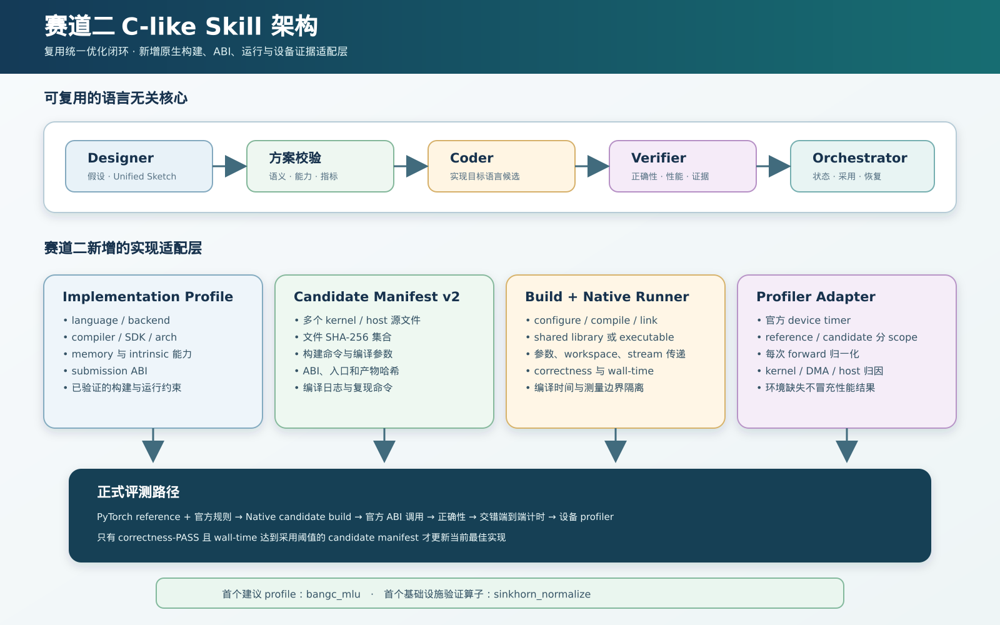
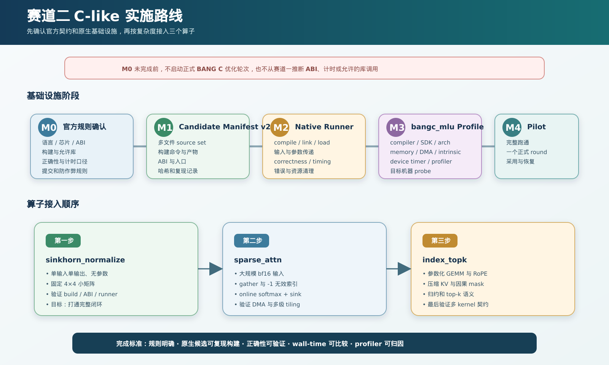

# 赛道二 C-like Skill 扩展路线

## 结论

赛道二不需要复制一套新的 Designer / Coder / Verifier / Orchestrator 状态机。建议继续使用 `kernel-opt-loop` 作为语言无关的优化闭环，在其下增加 **implementation profile + build adapter + runner adapter + profiler adapter**。

当前 v1 契约仍是赛道一实现：Python `ModelNew` 候选、单个 `.py` 文件、`auto_bench.py` 加载，以及 Triton target profile。赛道二尚不能直接启动正式优化轮次。



## 当前赛题形态

| Task | 算子 | 目标输入 | 主要实现难点 |
|---|---|---|---|
| 1 | `sparse_attn` | `q [8,2600,64,128]` bf16、`kv [8,32,128]` bf16、top-k=16 | 非连续 gather、online softmax、attention sink 仅进入分母、无效索引 `-1` |
| 2 | `index_topk` | `x [8,2600,1024]` bf16、`qr [8,2600,256]` bf16、top-k=128 | 参数化 GEMM、RoPE、压缩 KV、因果 mask、分数聚合和 top-k 排序语义 |
| 3 | `sinkhorn_normalize` | `x [1,1024,4,4]` fp32、repeat=10 | 大量独立小矩阵、重复行列归一化、启动开销与片上常驻 |

三个 `base.py` 已位于 `kernels/track2-clike/`。仓库根 `auto_bench.py` 只接受 `.py` 文件，并要求候选暴露 `ModelNew/get_init_inputs/get_inputs`，因此它不能直接编译或加载 C-like 多文件候选。

## v1 契约中需要解除的 Triton 假设

### 1. 候选不再是单文件

当前 canonical 指针是 `last_accepted_kernel`，Coder 从一个 Python 文件复制下一轮候选。C-like 候选通常至少包括：

- 设备 kernel 源文件，例如 `.mlu` / `.cpp` / `.cc`；
- host launcher 或 Python binding；
- 头文件；
- `CMakeLists.txt` 或确定性的构建脚本；
- 可选静态库、共享库或可执行程序；
- 运行配置和编译日志。

需要把 canonical 单文件指针升级为 `last_accepted_candidate_manifest`。manifest 记录源文件集合、每个文件的 SHA-256、构建命令、编译产物、ABI 和运行入口。

### 2. 本地 gate 不再是 `ast.parse`

当前 Coder gate 是 Python AST、真实 harness loader 和一次 warm-up。C-like gate 应由 implementation profile 定义：

1. source manifest 完整性；
2. 编译器和 SDK identity 匹配；
3. configure / compile / link 成功；
4. ABI 符号或可执行入口存在；
5. 一次目标设备 smoke execution；
6. 编译日志和产物哈希落盘。

编译缓存可以复用，但 cache key 必须包含所有源文件哈希、编译器版本、SDK、目标架构、编译参数和链接依赖。

### 3. Harness 需要 runner adapter

不要把 C-like 逻辑硬塞进 `auto_bench.py`。建议定义统一 runner 接口：

```text
prepare(reference, candidate, runtime_fingerprint)
build(candidate_manifest) -> build_artifact
load_or_launch(build_artifact, inputs, state)
correctness(reference_output, candidate_output, tolerances)
time(build_artifact, warmup, repeat) -> ordered_samples
profile(build_artifact, scope, iterations) -> normalized_evidence
cleanup()
```

v1 runner 是 `python_modelnew`，继续调用现有 `auto_bench.py`。赛道二新增 `native_clike` runner，通过官方 ABI、共享库 binding 或官方可执行 harness 调用候选。

正式实现 runner 前必须先确认官方赛道二提交和评测接口。若官方仍要求 Python 包装层，该包装层只能负责参数传递和调用原生 kernel，不能回退到 PyTorch 计算。

### 4. Target profile 需要拆成 implementation profile

当前 `triton_mlu`、`triton_gcu` 等 profile 同时混合了语言、后端和工具链。赛道二建议显式记录：

- `language`: `triton` / `bangc` / 其他官方 C-like 语言；
- `backend`: `mlu` / 其他目标设备；
- `compiler`: 编译器路径、版本和 target arch；
- `sdk`: SDK 路径和版本；
- `build_adapter`: 构建方式；
- `runner_adapter`: 候选调用方式；
- `profiler_adapter`: profiler 和 device timer；
- `submission_abi`: 输入输出、参数、stream、workspace 和错误处理约定；
- `capabilities`: memory hierarchy、DMA、barrier、vector/matrix primitive、core/grid mapping。

建议首个 profile 为 `bangc_mlu`，但只有在目标机器上完成编译、执行、数值和 profiler probe 后才能标记为 complete。

### 5. Unified Sketch 需要覆盖原生 kernel 信息

D/O/C/H 四段结构可以继续使用，不需要另造一种设计语言，但 C-like profile 应扩展可表达内容：

- **D — Declarations**：global/NRAM/SRAM/WRAM 等地址空间、alignment、stride、workspace、host/device 参数；
- **O — Operations**：DMA copy、async copy、barrier、vector/matrix intrinsic、原子操作和允许的库调用；
- **C — Control**：cluster/core/task 映射、流水阶段、同步点、尾块和错误路径；
- **H — Target Hints**：目标架构、core 类型、union mode、编译参数、片上容量和已验证的 intrinsic 限制。

Host Plan 对原生候选通常应为必填，至少描述 allocation、workspace、stream、lifetime、cache、并发和同步边界。

### 6. Verifier 需要原生构建和设备证据

赛道二 Verifier 除现有正确性和端到端计时外，还应验证：

- 编译不计入 benchmark 时间，除非官方规则明确包含；
- reference 与 candidate 使用完全相同的输入、参数状态和 stream；
- 原生调用后检查设备错误并同步；
- 输出 shape、dtype、数值容差、NaN/Inf 和特殊索引语义；
- workspace 越界、错误的 alias、生命周期或并发假设；
- device timer 与官方 wall-time 口径的关系；
- profiler 数据按每次 forward 归一化，且 reference/candidate 分 scope；
- 编译失败、设备丢失、SDK 不匹配和 profiler 缺失仍分类为环境问题，而不是性能失败。

对 BANG C，可优先调查 CNRT notifier、厂商 profiler 或官方 harness 提供的设备计时；在 probe 证明前，不得把 host launcher 时间冒充 kernel 时间。

## 三个算子的建议接入顺序

### 第一阶段：`sinkhorn_normalize`

最适合验证新 skill 基础设施：

- 无模型参数；
- 单输入单输出；
- shape 固定且 kernel 较小；
- 容易建立 CPU/PyTorch reference 与原生输出对比；
- 能验证编译、ABI、runner、计时、profiler 和多文件 artifact 流程。

完成标准不是追求最终加速比，而是完整跑通 Phase 0、一个 candidate round、Verifier 报告和 canonical candidate manifest。

### 第二阶段：`sparse_attn`

用于验证：

- 大规模 bf16 输入传递；
- gather 和 `-1` 无效索引；
- online softmax 数值稳定性；
- attention sink 只进入分母的特殊语义；
- 多级 tiling、片上容量和 DMA 流水。

### 第三阶段：`index_topk`

最后接入，因为它同时包含参数状态、多个线性层、RoPE、因果 mask、压缩 KV、归约和 top-k。需要先确定：

- 参数如何从参考 `state_dict` 传入原生实现；
- 是否允许调用厂商 GEMM/top-k 库；
- top-k 相等值排序和无效位置的官方判定；
- complex RoPE 在 ABI 中的表示；
- 一个候选能否由多个 kernel 和 host launcher 组成。

## 必须先从官方规则确认的事项

在创建第一个 C-like campaign 前，需要确认并记录：

1. 目标芯片和指定 C-like 语言；
2. 提交目录和必需文件；
3. 官方编译命令、编译器、SDK 和允许的链接库；
4. 候选 ABI，以及是否允许 Python binding；
5. 输入、模型参数、workspace 和 stream 的传递方式；
6. 编译时间是否计入性能；
7. warmup、repeat、同步和 wall-time 口径；
8. 正确性容差、特殊值和 top-k tie 规则；
9. 是否允许多 kernel、多阶段和厂商库调用；
10. profiler 工具和可提交的性能证据；
11. 动态 shape、并发、内存上限和超时规则；
12. 防作弊规则及 PyTorch fallback 限制。

这些值属于官方/用户拥有的契约，skill 不应从赛道一或某个候选实现中推断。

## 建议目录结构

```text
skills/kernel-opt-loop/
├── implementation_profiles/
│   ├── triton_<backend>.md
│   └── bangc_mlu.md
├── runners/
│   ├── python_modelnew.md
│   └── native_clike.md
├── build_adapters/
│   └── bangc_cmake.md
├── profiler_adapters/
│   └── bangc_mlu.md
└── scripts/
    ├── validate_candidate_manifest.py
    ├── build_native_candidate.py
    └── run_native_compare.py
```

为保持兼容，现有 `prompts/coder_targets/triton_*.md` 可以先继续使用；等 C-like runner 完成后再迁移到 `implementation_profiles/`，避免一次性破坏赛道一 campaign。

## 实施里程碑



| Milestone | 产出 | 完成条件 |
|---|---|---|
| M0 规则确认 | Track 2 evaluation contract | 上述 12 个官方问题均有明确答案 |
| M1 Candidate Manifest v2 | 多文件 source/build/ABI schema + validator | 缺文件、哈希漂移和 ABI 缺失可确定性失败 |
| M2 Native Runner | build/load/correctness/timing 接口 | 可比较一个原生 add/sinkhorn probe 与 PyTorch reference |
| M3 `bangc_mlu` Profile | 编译器、SDK、memory/intrinsic/profiler 能力表 | 匹配机器上 probe 编译、执行、数值检查通过 |
| M4 Sinkhorn Pilot | 第一条完整赛道二 round | Phase 0、Coder、Verifier、采用策略和恢复均通过 |
| M5 Profiler Normalization | 原生 device evidence | 可按 forward 归一化并区分 reference/candidate scope |
| M6 Sparse Attention | 第二个算子 | gather、sink softmax 和大输入路径通过 |
| M7 Index Top-k | 第三个算子 | 参数、RoPE、mask、top-k 与多 kernel 契约通过 |

## 推荐的下一步

先完成 M0，不要直接写正式 BANG C 优化代码。官方 ABI 和构建规则确认后，从 `sinkhorn_normalize` 建一个最小原生 runner probe；只有该 probe 能稳定完成编译、正确性、计时和 profiler，才把 `bangc_mlu` 标记为 complete 并允许 `kernel-opt-loop` 自动启动赛道二轮次。
